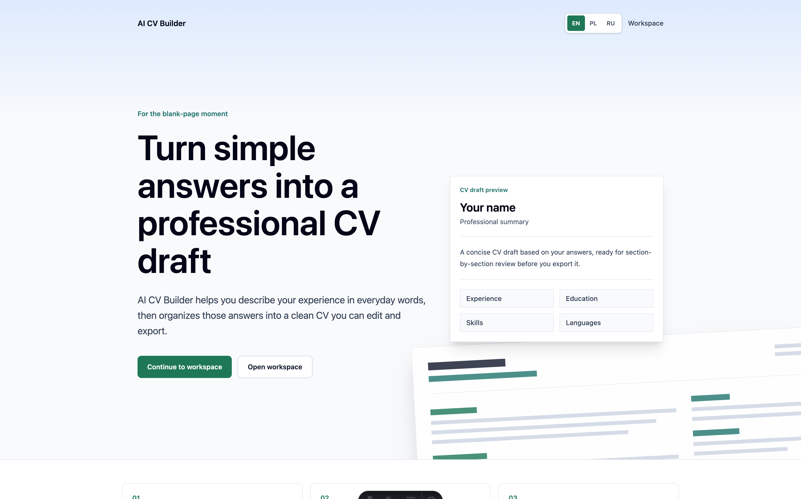

# AI CV Builder

Most people who need a CV get stuck at the blank page. Not because they have nothing to say, but
because they do not know which sections belong there, how to describe their own work, or what
"professional" is supposed to look like.

AI CV Builder replaces the blank page with a short guided questionnaire. You answer plain questions
about yourself; the app turns those answers into a structured CV in one clean template, lets you edit
it section by section, saves it to your account, and exports it as a PDF.

It never invents career facts. If an answer does not support a section, the draft leaves it empty and
says so — a CV you cannot defend in an interview is worse than a short one.



## What it does

- **Guided questionnaire** — seven plain-language fields (name, target role, experience, education,
  skills, spoken languages, extra context) plus the language the CV should be written in.
- **AI-generated draft** — answers become a structured draft with a summary, experience, education,
  skills, and languages, along with the assumptions the model made and warnings about thin input.
- **Section editing** — edit named sections in place. No full document editor, on purpose.
- **Saved CV library** — save, reopen, re-edit, and delete CVs from your account.
- **PDF export** — client-side rendering with fonts covering Latin, Polish diacritics, and Cyrillic.
- **Trilingual interface** — English, Polish, and Russian. The interface language and the CV output
  language are independent: reading the UI in Polish does not make your CV Polish.

## Tech stack

- [Astro](https://astro.build/) v6 — server-first rendering (`output: "server"`)
- [React](https://react.dev/) v19 — interactive islands only
- [TypeScript](https://www.typescriptlang.org/) v5
- [Tailwind CSS](https://tailwindcss.com/) v4 + [shadcn/ui](https://ui.shadcn.com/) ("new-york")
- [Supabase](https://supabase.com/) — auth and Postgres with row-level security
- [zod](https://zod.dev/) v4 — request and model-output validation
- [@react-pdf/renderer](https://react-pdf.org/) — PDF export in the browser
- [OpenAI](https://platform.openai.com/) — draft generation via strict structured outputs
- [vitest](https://vitest.dev/) v4 — unit tests
- [Cloudflare Workers](https://workers.cloudflare.com/) — deployment target

## Prerequisites

- Node.js v22.14.0 (see `.nvmrc`)
- [Docker](https://www.docker.com/) with ~7 GB RAM, for the local Supabase stack
- An [OpenAI API key](https://platform.openai.com/api-keys) — without it the app runs, but CV
  generation returns a "service unavailable" state

## Getting started

```bash
git clone https://github.com/Dergacz/AI_CV_Builder.git
cd AI_CV_Builder
npm ci
```

Start the local Supabase stack (downloads Docker images on the first run):

```bash
npx supabase start
```

`npx supabase status` prints the credentials. Put the `Project URL` in `SUPABASE_URL` and the
**Publishable** key (`sb_publishable_…`) in `SUPABASE_KEY` — never the `Secret` one, which bypasses
row-level security. They go in two files: `.env` for the Astro/Node toolchain and `.dev.vars` for the
Cloudflare dev runtime. Both are gitignored; `.env.example` lists the keys:

```bash
cp .env.example .env
cp .env.example .dev.vars
```

Apply the database schema and regenerate the typed client:

```bash
npm run db:reset    # applies supabase/migrations/, creating public.cvs with its RLS policies
npm run db:types    # regenerates src/db/database.types.ts from the live schema
```

Run the dev server — it uses the Cloudflare `workerd` runtime, so it reads secrets from `.dev.vars`:

```bash
npm run dev         # http://localhost:4321
```

The local Supabase Studio is at `http://localhost:54323`.

### Email confirmation in local development

Confirmation is off by default locally (`enable_confirmations = false` under `[auth.email]` in
`supabase/config.toml`), so a new account can sign in immediately. Signup mail still goes to the local
mailbox UI at `http://localhost:54324` — its links are built from `site_url`, which the same file pins
to `http://localhost:4321`. Changing anything under `[auth.*]` requires
`npx supabase stop && npx supabase start`; the running container will not pick it up otherwise.

### Email confirmation in production (dashboard-only settings)

`supabase/config.toml` configures the **local** stack only. The hosted project has its own copy of
these settings under **Authentication → URL Configuration**, and nothing in this repository can set
or verify them:

| Setting              | Value                                                                 |
| -------------------- | --------------------------------------------------------------------- |
| `Site URL`           | the production origin (**not** `http://localhost:4321`)               |
| Redirect URLs        | `https://<prod-host>/auth/confirm` and `https://<prod-host>/auth/callback` |

`/auth/confirm` receives the signup confirmation link, `/auth/callback` the Google round-trip. The
app passes `emailRedirectTo` on both senders (`src/lib/auth/email-redirect.ts`), but **GoTrue
silently discards a `redirect_to` that is not on the allow-list** and falls back to `Site URL`. That
failure is invisible from the code: the link still resolves, it just lands on the wrong page. So
after changing either setting, verify by clicking a real link from a real signup email — manual
check `M-5` in `context/foundation/test-plan.md` scripts it.

This is the same class of dashboard-only configuration as the Google provider credentials below, and
the same class of defect: a `Site URL` left at `localhost` sent every production confirmation email
to a host the user could not reach (roadmap S-10).

Preview deployments (`preview_urls` in `wrangler.jsonc`) serve from a hostname that cannot be
allow-listed ahead of time, so confirmation links sent from a preview fall back to the production
`Site URL`. That is the intended degradation — preview signups confirm against production.

## Environment variables

All are declared in `astro.config.mjs` under `env.schema`. Everything except the two `PUBLIC_`
entries is **server-only** and never reaches the client bundle. Every one is `optional`, so a missing
value degrades a feature rather than crashing the app.

| Variable                    | Required for      | Missing-value behavior                                      |
| --------------------------- | ----------------- | ----------------------------------------------------------- |
| `SUPABASE_URL`              | auth, saved CVs   | Config banner on every page; auth and persistence disabled  |
| `SUPABASE_KEY`              | auth, saved CVs   | Same as above (publishable/anon key — never a secret key)   |
| `SUPABASE_SECRET_KEY`       | account deletion  | `/account` shows "unavailable"; the delete route 503s       |
| `OPENAI_API_KEY`            | CV generation     | `POST /api/cv/generate` answers 503 `service_unavailable`   |
| `OPENAI_MODEL`              | —                 | Falls back to `gpt-4o-mini`                                 |
| `POSTHOG_API_KEY`           | analytics, errors | Server-side observability emission disabled; config banner  |
| `POSTHOG_HOST`              | —                 | Defaults to the EU ingest host                              |
| `OBSERVABILITY_ID_SALT`     | analytics         | Pseudonymous user IDs cannot be derived                     |
| `OBSERVABILITY_SMOKE_TOKEN` | F-01 smoke check  | `/api/observability/smoke` stays a `404` — the safe default |
| `GENERATION_DAILY_LIMIT`    | —                 | Falls back to the default in `generation-quota.ts`          |
| `GENERATION_HOURLY_CEILING` | —                 | Same as above                                               |
| `PUBLIC_POSTHOG_KEY`        | browser analytics | Client-side capture disabled                                |
| `PUBLIC_POSTHOG_HOST`       | —                 | Defaults to the EU ingest host                              |

## Scripts

| Command                     | What it does                                                |
| --------------------------- | ----------------------------------------------------------- |
| `npm run dev`               | Dev server on the Cloudflare `workerd` runtime              |
| `npm run build`             | Production build (SSR via `@astrojs/cloudflare`)            |
| `npm run preview`           | Preview the production build                                |
| `npm run test`              | Unit tests (vitest)                                         |
| `npm run test:db`           | pgTAP database tests (needs `npm run db:start`)             |
| `npm run lint` / `lint:fix` | ESLint with type-checked rules                              |
| `npm run format`            | Prettier, including Astro and Tailwind class ordering       |
| `npm run db:start`          | Start the local Supabase stack                              |
| `npm run db:reset`          | Drop and rebuild the local DB from `supabase/migrations/`   |
| `npm run db:types`          | Regenerate `src/db/database.types.ts` from the local schema |

A husky pre-commit hook runs `eslint --fix` on staged `*.{ts,tsx,astro}` and `prettier --write` on
staged `*.{json,css,md}`.

## Account deletion and the Supabase secret key

Deleting an account means deleting one row — `auth.users` — and letting the `on delete cascade`
foreign keys on `cvs`, `subscriptions`, `feedback`, and `generation_usage` take the rest with it.
Removing that row requires the Supabase **secret** (service-role) key, which is the
highest-privilege value in the project: it **bypasses row-level security entirely**.

Where it comes from:

- **Local:** `npx supabase status` prints it as `Secret` (`sb_secret_…`; the legacy `service_role`
  JWT works too). Put it in `.env` and `.dev.vars` as `SUPABASE_SECRET_KEY` — both are gitignored.
- **Production:** the Supabase dashboard (**Project Settings → API keys**). Set it as a Cloudflare
  Worker secret, never as a default in `astro.config.mjs` and never in a committed file:

  ```bash
  npx wrangler secret put SUPABASE_SECRET_KEY
  ```

How its blast radius is kept small:

- Exactly one module reads it — `src/lib/supabase-admin.ts` — and it exports no raw admin client,
  only `deleteUserAccount(userId)` and `isAdminConfigured()`. An ESLint `no-restricted-imports`
  fence in `eslint.config.js` makes importing that module from anywhere but
  `src/lib/services/account-deletion.ts` a lint error, so a future route cannot quietly widen the
  key's reach.
- The admin client is built per request inside the deletion path, with `persistSession: false` and
  `autoRefreshToken: false` — no session storage in a Worker that has none.
- **Rotation is safe and cheap.** Nothing else reads the key, so rotating it in Supabase and
  re-running `wrangler secret put` affects only account deletion, with no migration or redeploy
  coupling.

**Omitting it degrades, it does not break.** `isAdminConfigured()` is false, `/account` renders the
"account deletion is temporarily unavailable" state with no clickable delete button, and
`POST /api/account/delete` answers `503 service_unavailable` without touching any data. That is
also the kill switch: unset the secret to disable the surface immediately. Note the flip side —
erasure is a legal obligation, so an unset secret in production is a compliance problem, not a
tolerable default. Treat it as a release blocker.

The cascade itself is pinned by a pgTAP test (`npm run test:db`, see [Testing](#testing)), which
also fails if a _new_ table starts referencing `auth.users` without `on delete cascade`.

## Google sign-in (OAuth)

"Continue with Google" is wired through Supabase's external Google provider, enabled in `supabase/config.toml` under `[auth.external.google]` via `env()` substitution. To exercise it locally:

1. In the [Google Cloud Console](https://console.cloud.google.com/apis/credentials), create an **OAuth 2.0 Client ID** of type **Web application**.
2. Add the Supabase auth callback as an **authorized redirect URI**: `http://127.0.0.1:54321/auth/v1/callback` (the local Supabase auth endpoint).
3. Put the client id and secret in your `.env` (see `.env.example`):

   ```bash
   SUPABASE_AUTH_EXTERNAL_GOOGLE_CLIENT_ID=<client id>
   SUPABASE_AUTH_EXTERNAL_GOOGLE_SECRET=<client secret>
   ```

4. Export these into the shell (or `source .env`) **before** running `npx supabase start` — the local Supabase container reads them via env substitution. `skip_nonce_check = true` is set for local; the app's own callback URL (`/auth/callback`) is allow-listed in `additional_redirect_urls`.

In production, set the same two values in the hosted Supabase dashboard (**Authentication → Providers → Google**) rather than in env files.

## PostHog Observability Configuration

This project uses PostHog EU Cloud for product analytics and error monitoring. PostHog is optional in local development; when `POSTHOG_API_KEY` is absent, observability emission is disabled and the app shows the configuration banner.

Create a PostHog EU Cloud project and store its keys in your local `.env` and `.dev.vars` files:

| Variable                | Description                                                     |
| ----------------------- | --------------------------------------------------------------- |
| `POSTHOG_API_KEY`       | Server-side PostHog project token for HTTP capture              |
| `POSTHOG_HOST`          | Server capture host; use `https://eu.i.posthog.com` by default  |
| `OBSERVABILITY_ID_SALT` | Server-only salt for deterministic pseudonymous user IDs        |
| `PUBLIC_POSTHOG_KEY`    | Browser-readable PostHog project token                          |
| `PUBLIC_POSTHOG_HOST`   | Browser capture host; use `https://eu.i.posthog.com` by default |

For Cloudflare Workers production, store secrets with Wrangler:

```bash
npx wrangler secret put POSTHOG_API_KEY
npx wrangler secret put OBSERVABILITY_ID_SALT
```

`POSTHOG_HOST` and `PUBLIC_POSTHOG_HOST` should remain on the EU ingest host unless the project intentionally moves regions or adds a first-party proxy.

### Smoke triggers (F-01 proof-of-life)

Two guarded triggers prove the observability pipeline reaches PostHog EU end-to-end. Both are **off by default** and must not be reachable by production traffic:

- **Server:** `GET|POST /api/observability/smoke` returns `404` unless `OBSERVABILITY_SMOKE_TOKEN` is set **and** the request supplies a matching token (header `x-observability-smoke-token` or `?token=`). Production never sets the secret, so the route stays a 404. When fired, it emits one `observability_smoke` event and one `observability_error`.
- **Client:** `window.__obsSmoke()` exists only in dev builds (guarded by `import.meta.env.DEV`). Call it from devtools to emit one client `observability_smoke` event and dispatch a test error through the browser error hook.

After F-01 verification, keep both disabled by leaving `OBSERVABILITY_SMOKE_TOKEN` unset (server) and shipping production builds (client trigger is stripped). The triggers carry only `surface`/`error_location`/`error_type` — never answer, prompt, draft, or CV content.

## Project structure

```text
src/
├── pages/                    # Astro routes (server-rendered; no test files here — see below)
│   ├── api/auth/             # signin, signup, signout
│   ├── api/cv/               # index (list/create), [id] (read/update/delete), generate
│   └── cv/                   # new.astro (questionnaire), [id].astro (saved CV)
├── components/
│   ├── auth/                 # sign-in / sign-up React islands
│   ├── cv/                   # questionnaire, editor, template, PDF document, library
│   ├── hooks/                # useCvDraftEditor, useCvSave, useCvExport
│   └── ui/                   # shadcn/ui components
├── lib/
│   ├── services/             # cv-generation (OpenAI), cv-repository (persistence)
│   ├── i18n/                 # locale resolution and message catalogs
│   └── *.ts                  # schemas, copy, helpers (+ colocated unit tests)
├── tests/                    # route/API tests and shared fakes
├── db/database.types.ts      # generated by `npm run db:types`
├── middleware.ts             # resolves the user, guards PROTECTED_ROUTES
└── types.ts                  # shared entities and DTOs
supabase/migrations/          # SQL migrations
context/                      # product foundation and per-change plans (see below)
```

## Routes

| Route                          | Description                                     |
| ------------------------------ | ----------------------------------------------- |
| `/`                            | Landing page and entry point into CV creation   |
| `/auth/signin`, `/auth/signup` | Email/password auth                             |
| `/auth/confirm-email`          | Post-signup "check your inbox" page             |
| `/dashboard`                   | Saved CV library — open or delete previous CVs  |
| `/account`                     | Account settings and permanent account deletion |
| `/cv/new`                      | Guided questionnaire and draft review           |
| `/cv/[id]`                     | Reopen a saved CV for editing and export        |

| API                                       | Methods                                         |
| ----------------------------------------- | ----------------------------------------------- |
| `/api/cv`                                 | `GET` list the caller's CVs, `POST` create      |
| `/api/cv/[id]`                            | `GET` read, `PUT` overwrite, `DELETE` remove    |
| `/api/cv/generate`                        | `POST` questionnaire answers → structured draft |
| `/api/auth/signin`, `/signup`, `/signout` | `POST`                                          |
| `/api/account/delete`                     | `POST` permanently delete the caller's account  |
| `/api/locale`                             | `POST` set the interface locale cookie          |

Authentication is cookie-based (`@supabase/ssr`). `src/middleware.ts` resolves the user on every
request and redirects anonymous traffic away from the paths in `PROTECTED_ROUTES` — add paths there
rather than duplicating guards in individual pages.

## Database

One table, `public.cvs`, created by `supabase/migrations/20260606103740_create_cvs.sql`:

- `draft` (JSONB) — the generated CV, validated against the zod schema in `src/lib/cv-draft.ts`.
- `source_snapshot` (JSONB) — the questionnaire answers that produced it, plus their version.
- `title`, `language`, `created_at`, `updated_at` — kept as flat columns so the dashboard can list
  CVs without loading any CV content.

Row-level security is enabled with owner-only policies on **select, insert, update, and delete**.
The repository layer (`src/lib/services/cv-repository.ts`) also filters every query on `user_id` as
a second, independent line of defense. A request for another account's CV answers `404`, never
`403` — a `403` would confirm the row exists.

## Testing

```bash
npm run test      # unit tests (vitest)
npm run test:db   # pgTAP database tests — needs the local stack up (npm run db:start)
```

`npm run test:db` runs `supabase/tests/database/*.test.sql` through the Supabase CLI. It pins the
account-deletion cascade: the erasure claim rests entirely on `on delete cascade`, so the test seeds
one row per user-scoped table, deletes the `auth.users` row, asserts nothing survives, and inventories
every `public` foreign key into `auth.users` so a new table without a cascade fails loudly. Like the
E2E suite, it is **not** in CI — `ci.yml` has no Postgres.

Strategy, the risk register, and the manual checks that cannot be automated live in
[`context/foundation/test-plan.md`](context/foundation/test-plan.md). Two conventions matter:

- Helper tests sit next to their module in `src/lib/`; route, API, and cross-module tests go in
  `src/tests/`.
- **Never put a test file under `src/pages/`.** Astro turns every module there into a route, so the
  test becomes a public endpoint and pulls `vitest` into the deployed Worker bundle.
  `src/tests/no-tests-under-pages.test.ts` fails if this recurs.

## CI/CD

| Workflow                       | Trigger                  | Steps                                    |
| ------------------------------ | ------------------------ | ---------------------------------------- |
| `.github/workflows/ci.yml`     | Pull request to `master` | `astro sync` → `lint` → `test` → `build` |
| `.github/workflows/deploy.yml` | Push to `master`         | The same gates, then `wrangler deploy`   |

Repository secrets: `SUPABASE_URL` and `SUPABASE_KEY` for the build, plus `CLOUDFLARE_API_TOKEN` and
`CLOUDFLARE_ACCOUNT_ID` for deployment. Runtime secrets on Cloudflare are set separately with
`npx wrangler secret put <NAME>`.

To deploy by hand:

```bash
npm run build
npx wrangler deploy
```

Set `SUPABASE_URL`, `SUPABASE_KEY`, `POSTHOG_API_KEY`, and `OBSERVABILITY_ID_SALT` as secrets in your
Cloudflare dashboard or via `npx wrangler secret put`.

## Documentation

The product is built from written foundation documents, not the other way round:

| Document                                                                       | Contents                                               |
| ------------------------------------------------------------------------------ | ------------------------------------------------------ |
| [`context/foundation/prd.md`](context/foundation/prd.md)                       | Vision, persona, user stories, functional requirements |
| [`context/foundation/roadmap.md`](context/foundation/roadmap.md)               | Delivery slices F-01…S-09 with dependencies and status |
| [`context/foundation/test-plan.md`](context/foundation/test-plan.md)           | Test strategy and risk register                        |
| [`context/foundation/tech-stack.md`](context/foundation/tech-stack.md)         | Why this stack was chosen                              |
| [`context/foundation/infrastructure.md`](context/foundation/infrastructure.md) | Deployment platform decision and risk register         |
| [`context/foundation/lessons.md`](context/foundation/lessons.md)               | Recurring rules and pitfalls                           |
| `context/changes/<id>/`                                                        | Per-change briefs, plans, research, and reviews        |
| [`AGENTS.md`](AGENTS.md) / [`CLAUDE.md`](CLAUDE.md)                            | Working agreements for AI coding agents                |

## License

MIT
